# 🥪 Recipe Book

Share, Discover & Cook Delicious Recipes

Recipe Book is a platform where food lovers can **share their favorite
recipes**, **discover new dishes**, and **organize cooking ideas** in
one place. Whether you're a beginner or a pro chef, this app makes
cooking fun and collaborative.

## ✨ Features

-   🔴 Add, edit, and organize your recipes easily
-   🟠 Search recipes by name, ingredients, or category
-   🟡 Rate and review recipes shared by others
-   🟢 Upload and showcase images of your dishes
-   🔵 Create your personal cooking collection
-   🟣 Mobile-friendly and responsive design

## 🛠 Technology Used

-   **Backend**: Spring Boot (Java)
-   **Frontend**: Thymeleaf + Bootstrap
-   **Database**: MySQL
-   **Security**: Spring Security + OAuth (Google, Facebook)
-   **Other**: Summernote editor, REST APIs

## 🌮 Screenshots

     

        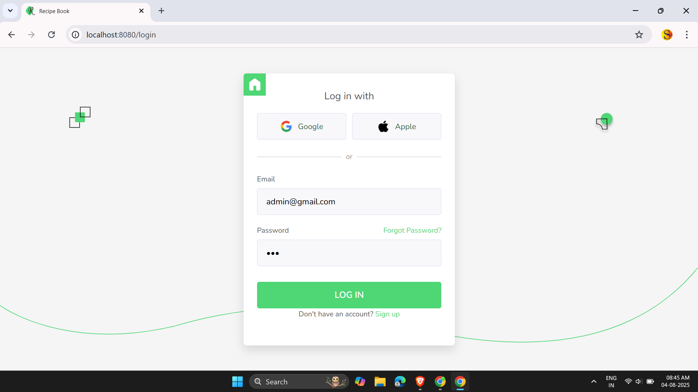
        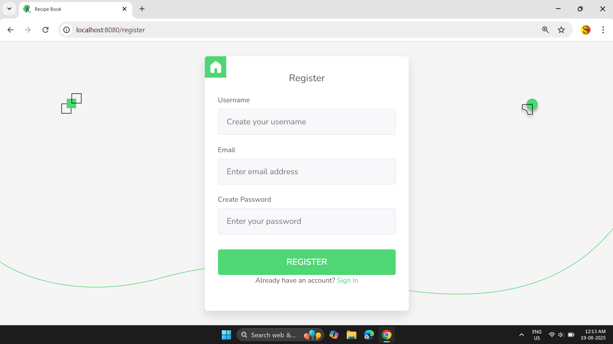
    

     

        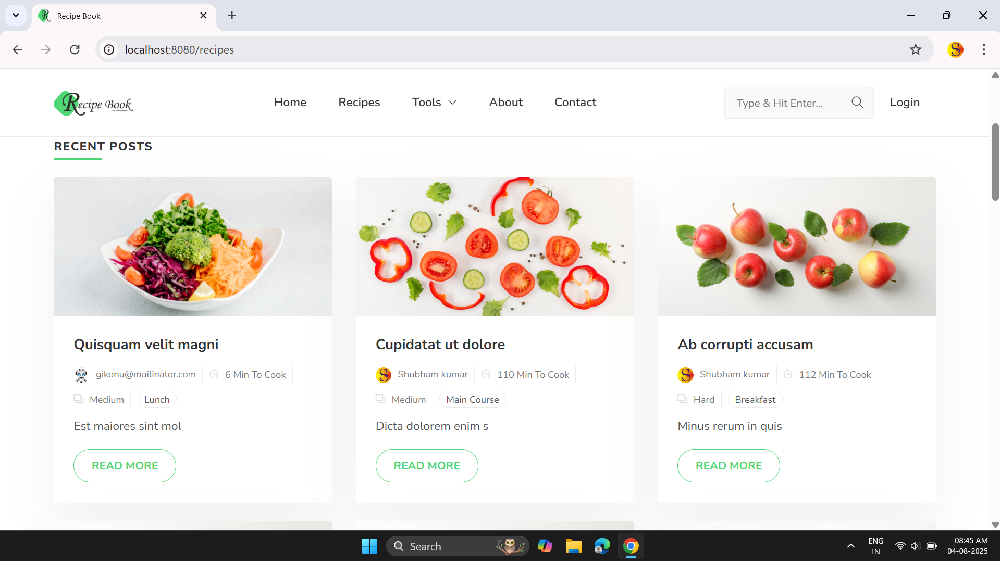
        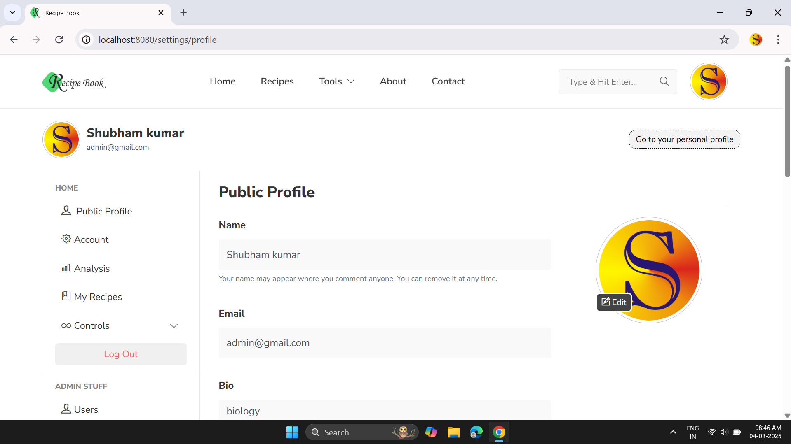
    

     

        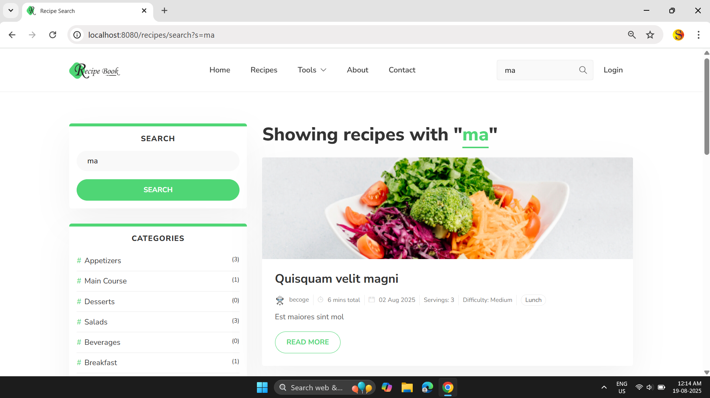
        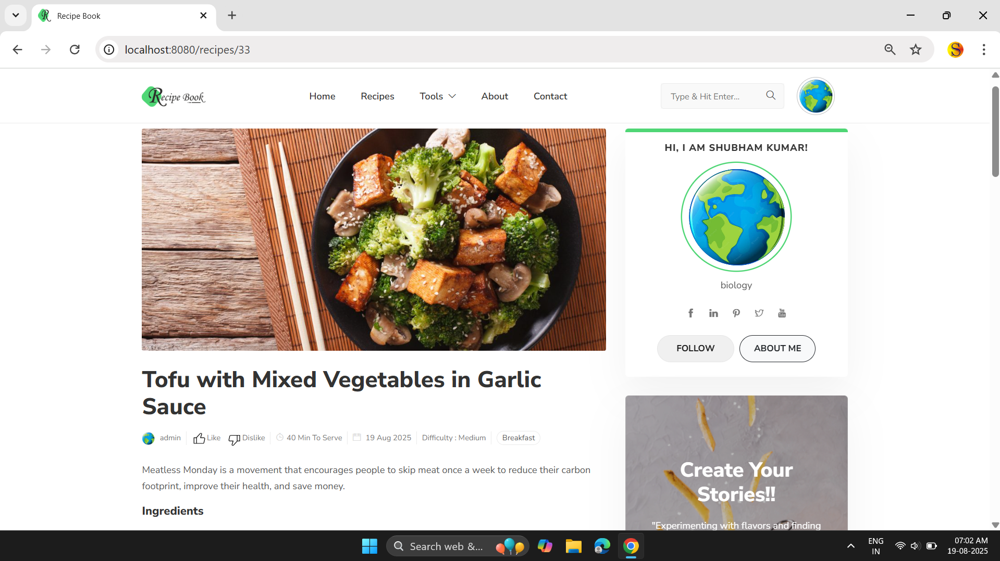
    

     

        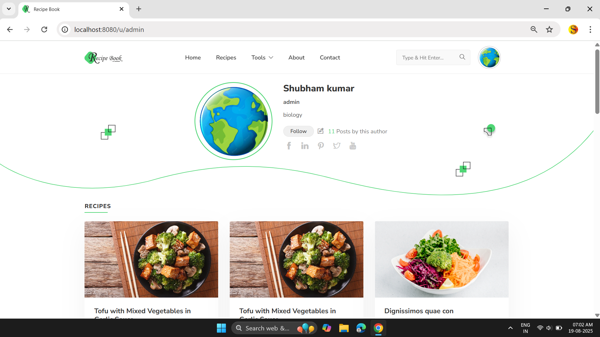
        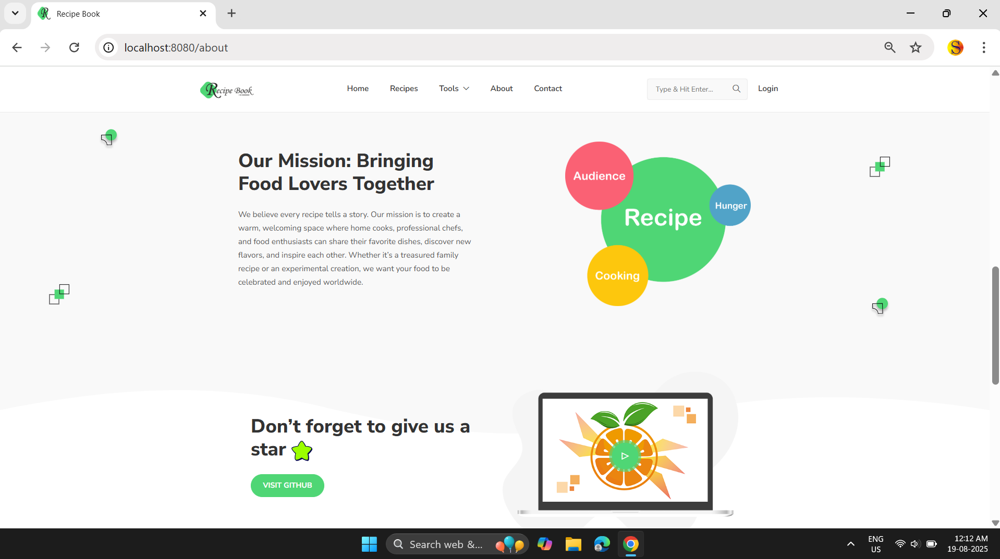
    

     

        
        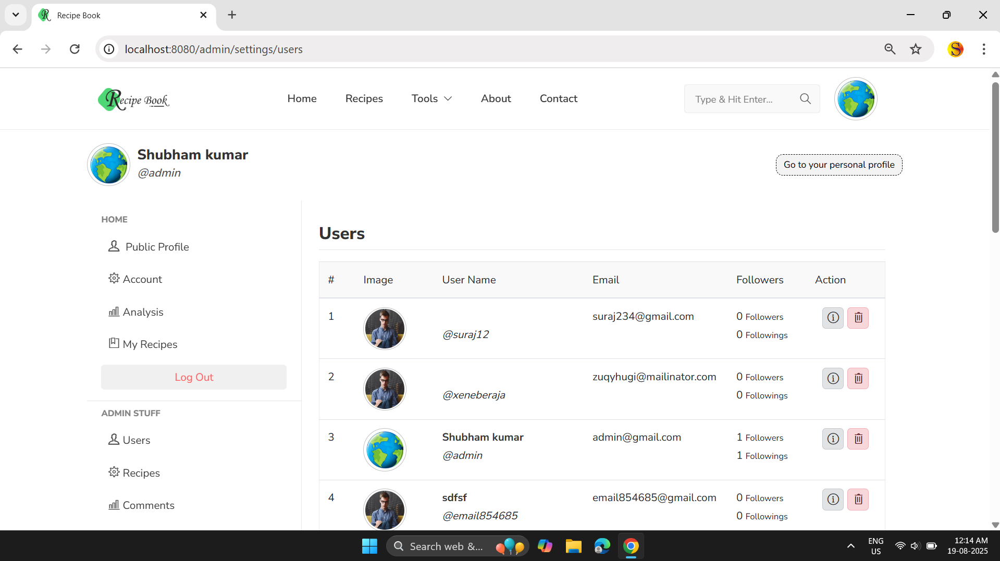
    

     

        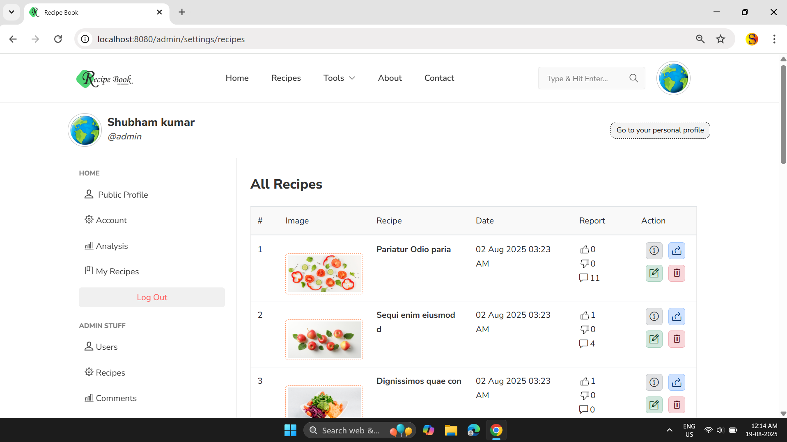
        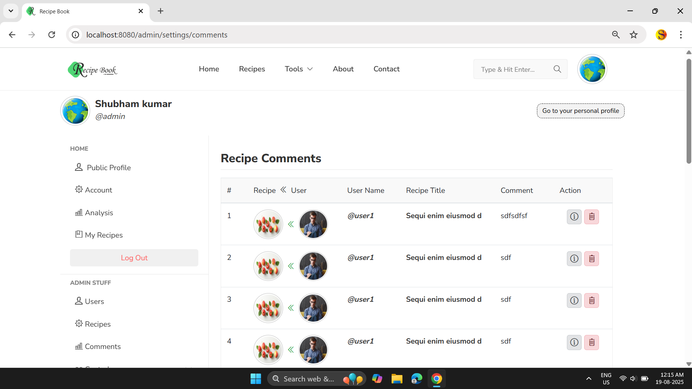
    

## 🚀 Installation

1.  Clone the repository: git clone
    https://github.com/your-username/recipe-book.git cd recipe-book

2.  Configure the database:

    -   Create a MySQL database (e.g., recipe_book)
    -   Update application.yml or application.properties with your DB
        credentials

3.  Run the application: ./mvnw spring-boot:run

4.  Access the app:  http://localhost:8080

## 🤝 Contributing

Contributions are welcome! 🎉 - Fork the repo - Create a feature
branch - Submit a pull request

## 📄 License

This project is licensed under the MIT License.

🍕 Made with ❤️ for food lovers everywhere!
